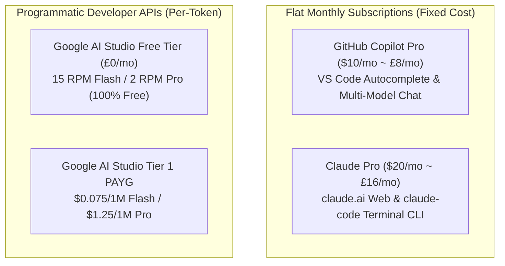

# AI Model Pricing, Billing Mechanics & Tooling Comparison 📊💳

This document summarizes model billing structures, developer API mechanics vs. consumer subscriptions, project cost breakdowns, and a comparative analysis of **GitHub Copilot Pro**, **Claude Pro / Claude Code**, and **Google Gemini Developer APIs**.

---

## 1. Consumer Subscriptions vs. Developer API Billing

A common point of confusion is the distinction between consumer-facing web subscriptions and programmatic developer API billing:

| Category | **Consumer Web Subscription** | **Developer API Keys** |
| :--- | :--- | :--- |
| **Examples** | Google AI Premium (£18.99/mo), Claude Pro (£16/mo), ChatGPT Plus ($20/mo). | Google AI Studio (`GEMINI_API_KEY`), Anthropic API (`ANTHROPIC_API_KEY`), OpenAI API. |
| **Where Used** | Web browser chat interfaces (`gemini.google.com`, `claude.ai`). | Terminal CLI tools (`agy`, `claude-code`), IDE extensions, agentic scripts. |
| **Billing Model** | **Fixed Monthly Subscription Fee** (Flat rate). | **Pay-As-You-Go per Token** (Input & Output throughput) OR Free Tier rate limits. |
| **Data Usage** | Free consumer tier chat data may be sampled for training. | Paid API data is **100% private** and never used for model training. |

---

## 2. Analysis of Recent Project API Billing (~£8.14 Total)

During the development and refactoring of the 9 industrial PLC demonstrator projects:

1. **Why API Charges Accrued**:
   - The developer project was linked to Google Cloud Billing Account `0162A0-9D15DC-66951F` on Google AI Studio (`gen-lang-client-0237709252` and `api-project-49779932914`).
   - When a billing account is attached, Google AI Studio routes requests through **Tier 1 (Pay-As-You-Go)** to remove rate-limit pauses (allowing fast execution without `429 Too Many Requests` errors).
2. **Cost Efficiency**:
   - Generating, debugging, styling, compiling, and deploying 9 full interactive SCADA web applications (including soft-PLC engines, Ladder Diagrams, Structured Text viewers, 5-train dynamic simulations, and Web Speech PA audio systems) accrued a cumulative total of **~£8.14 GBP** (~£0.90 per full industrial project).

---

## 3. Comparative Analysis: GitHub Copilot Pro vs. Claude Pro vs. Gemini PAYG

| Feature | **GitHub Copilot Pro** | **Claude Pro / Claude Code** | **Google Gemini APIs (PAYG)** |
| :--- | :--- | :--- | :--- |
| **Monthly Pricing** | **$10 / mo** (~£8/mo) | **$20 / mo** (~£16/mo) | **Variable** (~$0.075/1M Flash, ~$1.25/1M Pro) |
| **Billing Structure** | **Flat-Rate Subscription** | **Flat-Rate Subscription** | **Pay-As-You-Go per Token** (or £0 Free Tier) |
| **Selectable Models** | GPT-4o, Claude 3.5 Sonnet, Gemini 1.5 Pro | Claude 3.5 Sonnet, Claude 3.0 Opus | Gemini 2.0 Flash, Gemini 1.5 Pro, Flash-Thinking |
| **Context Window** | 32k – 128k tokens | 200k tokens | **1,000,000 to 2,000,000 tokens** |
| **Best Workflow** | Inline tab-autocomplete & IDE Chat | Autonomous terminal CLI (`claude-code`) | Massive context processing & low-cost CLI agents |

---

## 4. Swapping LLMs & Switching to GitHub Copilot Pro

### Can `agy` (Antigravity CLI) Use GitHub Copilot Pro Credentials Directly?
- **No**. GitHub Copilot Pro ($10/mo) is an IDE subscription managed via GitHub OAuth. GitHub does not export a raw OpenAI/Anthropic API key for use in third-party CLI tools like `agy`.
- `agy` connects natively to **Google Gemini APIs** (`GEMINI_API_KEY`).

### How to Stop Paying for Gemini API while keeping `agy`:
To run `agy` for **100% FREE (£0.00/month)**:
1. Go to **[aistudio.google.com](https://aistudio.google.com/)**.
2. Unlink your GCP Billing Account from your AI Studio project (or create an API key in a project with no billing attached).
3. Set `export GEMINI_API_KEY="your_free_tier_key"`.
4. `agy` will run on the **Google AI Studio Free Tier (£0.00/mo)**.

### How to Use GitHub Copilot Pro for This Repository:
1. Open the repository in VS Code with the **GitHub Copilot** extension enabled.
2. Open Copilot Chat (`Ctrl+Alt+I` / `Cmd+Alt+I`).
3. Select your target model in Copilot Chat (e.g. **Claude 3.5 Sonnet** or **GPT-4o**).
4. Feed the project prompt files (e.g. `prompts/conveyor-logic-prompt-1-copilot.md`) into Copilot Chat to execute project runs under your flat $10/mo subscription.
