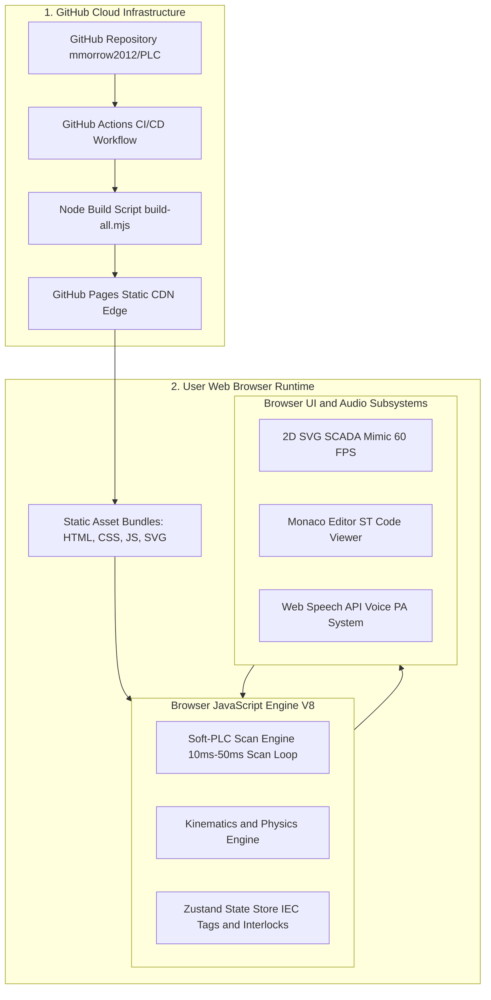

# Architecture & Static Hosting Specification 🌐⚙️

This document details the hosting infrastructure, build pipelines, and client-side execution architecture for the **Industrial PLC Demonstrator Suite**.

---

## 1. Executive Summary

All demonstrator web applications in this repository are **100% client-side applications** hosted on **GitHub Pages** (routed to `https://plc.coldwire.uk/`). There is **no backend server** (no Node.js, Python, database, or remote hardware container) processing events or calculating logic. Once static assets load, the entire industrial soft-PLC scan loop, SCADA visualizer, physics engine, and Web Speech API audio announcements execute locally within the user's browser.

---

## 2. System Architecture Diagram

---

## 3. Detailed Component Breakdown

### A. Static Delivery & CI/CD Deployment
- **Repository Build System**: Each project inside `projects/<id>/<agent>/code` is an isolated React + TypeScript + Vite project.
- **Automated Multi-App Pipeline**: Running `node scripts/build-all.mjs` executes Vite builds across all scaffolded apps with relative `--base` paths (e.g. `/09-uk-railway-network-controller/gemini/`).
- **CDN Edge Serving**: GitHub Pages delivers pre-compiled static `.js`, `.css`, and `.svg` files over HTTPS via global CDN edge nodes (Fastly / Cloudflare).

### B. In-Browser Client-Side Subsystems

| Subsystem | Technology | Execution Location | Description |
| :--- | :--- | :--- | :--- |
| **Soft-PLC Engine** | TypeScript & Zustand | Browser JS V8 Engine | Simulates IEC 61131-3 cyclic scan loops (4.2ms–50ms) using `requestAnimationFrame` / timers. |
| **Industrial Kinematics** | Differential Equations | Browser JS V8 Engine | Calculates real-time physical variables (tank levels, conveyor positions, train velocities). |
| **2D SCADA Mimic** | React & SVG | Browser GPU Graphics | Renders interactive vector graphics, animated signal heads, and liquid tanks at 60 FPS. |
| **Code Viewer** | Monaco Editor (`@monaco-editor/react`) | Web Worker / Client DOM | Provides VS Code syntax highlighting and live line execution tracking. |
| **Voice PA System** | Web Speech API | Operating System Voice Engine | Uses native browser speech synthesis (`window.speechSynthesis`) locally without streaming audio over network. |

---

## 4. Key Benefits

1. **Zero Server Operating Cost**: Hosted entirely free on static CDN infrastructure.
2. **Infinite Scalability**: Can serve thousands of concurrent visitors without server load limits or CPU bottlenecks.
3. **Offline Capability**: Once assets are cached by the browser, the application runs without needing an active internet connection.
4. **Instant Response Time**: Zero network latency for PLC inputs, emergency stops, or signal overrides.
